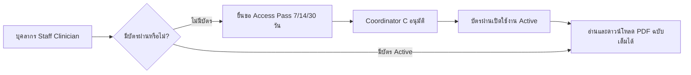

# คู่มือการใช้งานระบบ MedResearch DMS
## (Clinician & Hospital Staff User Manual)

ยินดีต้อนรับสู่ **MedResearch DMS (Central Medical Research & Manuscript Management System)** แพลตฟอร์มบริหารจัดการและประเมินงานวิจัยทางการแพทย์ระดับโรงพยาบาล ระบบนี้ออกแบบตามมาตรฐานการแพทย์สากล (GCP/ICMJE) โดยรวมบทบาทของแพทย์ผู้วิจัย (Author) และผู้ทรงคุณวุฒิประเมินบทความ (Peer Reviewer) ไว้ในบทบาทเดียว (**Unified `DOCTOR` Role**) พร้อมระบบความปลอดภัยสองชั้น (TOTP 2FA) และกลไกตัวกลางปิดผนึกข้อมูล (Double-Blind Air-Gapped Mediation)

---

## สารบัญ (Table of Contents)
1. [การเข้าสู่ระบบและความปลอดภัย (Authentication & 2FA Security)](#1-การเข้าสู่ระบบและความปลอดภัย-authentication--2fa-security)
2. [พื้นที่ทำงานแพทย์แบบรวมศูนย์ (Unified Doctor Workspace)](#2-พื้นที่ทำงานแพทย์แบบรวมศูนย์-unified-doctor-workspace)
   - [แท็บที่ 1: งานวิจัยของฉัน (My Researches)](#21-แท็บที่-1-งานวิจัยของฉัน-my-researches)
   - [แท็บที่ 2: งานที่ได้รับมอบหมายให้ตรวจ (Assigned Peer Reviews)](#22-แท็บที่-2-งานที่ได้รับมอบหมายให้ตรวจ-assigned-peer-reviews)
3. [โต๊ะตรวจประเมินแบบแยกหน้าจอ (Split-Screen Review Desk)](#3-โต๊ะตรวจประเมินแบบแยกหน้าจอ-split-screen-review-desk)
4. [คลังงานวิจัยโรงพยาบาลและบัตรผ่านอ่านบทความ (Catalog & Access Gate)](#4-คลังงานวิจัยโรงพยาบาลและบัตรผ่านอ่านบทความ-catalog--access-gate)
5. [คำถามที่พบบ่อย (FAQ & Troubleshooting)](#5-คำถามที่พบบ่อย-faq--troubleshooting)

---

## 1. การเข้าสู่ระบบและความปลอดภัย (Authentication & 2FA Security)

### 1.1 การลงชื่อเข้าใช้งานมาตรฐาน (Standard Login)
1. เปิดเว็บบราวเซอร์ไปที่ URL: `http://localhost:8000/accounts/login/`
2. กรอก **Username** และ **Password** ของท่าน
3. กดปุ่ม **Sign In**

> [!TIP]
> **บัญชีทดสอบสำหรับโหมดสาธิต (Pre-seeded Demo Personas):**
> - **Dr. Alice Mercer** (`alice` / `password123`): อายุรแพทย์โรคหัวใจ (Cardiologist) - ผู้วิจัยหลัก & ผู้ประเมิน
> - **Dr. Robert Chen** (`bob` / `password123`): ศัลยแพทย์มะเร็ง (Oncologic Surgeon) - ผู้วิจัยหลัก & ผู้ประเมิน
> - **Dr. Sarah Jenkins** (`sarah` / `password123`): แพทย์ประจำบ้านเวชศาสตร์ฉุกเฉิน (Clinical Fellow - Staff Viewer)

### 1.2 แถบสลับบทบาทจำลองแบบคลิกเดียว (One-Click Demo Switcher)
ที่ด้านบนสุดของทุกหน้าจอจะมีแถบ **Demo Switcher Bar** สีเข้ม ท่านสามารถคลิกเปลี่ยนตัวตนเป็นแพทย์ท่านอื่นได้ทันทีโดยไม่ต้องลงชื่อออก:
- 🩺 **Alice Mercer** (Doctor - Cardiology)
- 🔪 **Robert Chen** (Doctor - Surgery)
- 🔬 **Sarah Jenkins** (Staff Clinician - Emergency)

### 1.3 การตั้งค่ารหัสผ่านสองชั้น (TOTP Two-Factor Authentication)
เพื่อปกป้องข้อมูลวิจัยและเวชระเบียนผู้ป่วย ท่านสามารถผูกระบบกับแอปพลิเคชัน Authenticator บนสมาร์ทโฟนได้:
1. คลิกเมนู **"2FA Security"** ที่มุมขวาบนของแถบนำทาง (หรือไปที่ `/accounts/security/2fa/`)
2. เปิดแอป **Google Authenticator**, **Microsoft Authenticator** หรือ **1Password** บนสมาร์ทโฟน
3. สแกนภาพ **QR Code** ที่ปรากฏบนหน้าจอ (หรือพิมพ์รหัส Manual Setup Key ในกรณีที่กล้องไม่สามารถสแกนได้)
4. กรอกรหัสตัวเลข 6 หลักที่ปรากฏในแอปพลิเคชันลงในช่อง **Verification Token**
5. กดปุ่ม **"Confirm & Activate"**

> [!IMPORTANT]
> เมื่อเปิดใช้งาน 2FA สำเร็จ แถบสถานะบน Demo Switcher จะแสดงป้ายสีเขียว **2FA ON** และเมื่อลงชื่อเข้าใช้งานครั้งต่อไป ระบบจะนำท่านไปยังหน้า **2FA Challenge Gate** เพื่อยืนยันรหัส OTP เสมอ

---

## 2. พื้นที่ทำงานแพทย์แบบรวมศูนย์ (Unified Doctor Workspace)
**เข้าใช้งานที่:** `/doctor/dashboard/`

ในฐานะแพทย์ แพทย์ทุกคนจะมีบทบาท **`DOCTOR`** ที่สามารถส่งบทความวิจัยของตนเอง และได้รับมอบหมายให้ตรวจบทความของเพื่อนแพทย์ท่านอื่นได้ในหน้าจอเดียว โดยแบ่งออกเป็น 2 แท็บหลัก:

```
+-----------------------------------------------------------------------------------+
|  Doctor Clinical Workspace                                                        |
|  Dr. Alice Mercer • Cardiology • Interventional Cardiology                        |
|                                                                                   |
|  [ My Researches (3) ]          [ Assigned Peer Reviews (1 pending) ]             |
+-----------------------------------------------------------------------------------+
```

---

### 2.1 แท็บที่ 1: งานวิจัยของฉัน (My Researches)

แท็บนี้รวบรวมงานวิจัยทั้งหมดที่ท่านเป็นผู้วิจัยหลัก (Primary Investigator):

#### ก. การยื่นเสนอผลงานวิจัยใหม่ (New Submission)
1. คลิกปุ่ม **"+ New Research Submission"** ที่มุมขวาบน
2. กรอกข้อมูลให้ครบถ้วน:
   - **Manuscript Title:** ชื่อบทความวิจัย (เช่น *Clinical Evaluation of SGLT2 Inhibitors*)
   - **Category & Department:** สาขาวิจัยและแผนกคลินิก
   - **Co-Authors:** รายชื่อผู้วิจัยร่วม (ถ้ามี)
   - **Structured Abstract:** บทคัดย่อโครงสร้าง (Background, Methods, Results, Conclusions)
   - **Manuscript PDF:** อัปโหลดไฟล์เอกสารฉบับเต็ม (.pdf) ซึ่งจะถูกเข้ารหัสและจัดเก็บในโฟลเดอร์ปลอดภัย `protected_media/`
   - **Submission Remarks:** บันทึกข้อความถึงเลขาธิการวิจัย
3. กดปุ่ม **"Submit for Coordinator Triage"** บทความจะเข้าสู่สถานะ `PENDING_COORD`

#### ข. การติดตามสถานะบทความและรอบการตรวจ ($N$)
| ป้ายสถานะ (Status Badge) | ความหมาย | สิ่งที่ผู้วิจัยต้องทำ |
|---|---|---|
| <span style="color:#d97706; font-weight:bold;">PENDING TRIAGE</span> | อยู่ระหว่างรอ Coordinator C คัดกรองเบื้องต้น | รอการตรวจสอบเอกสาร |
| <span style="color:#2563eb; font-weight:bold;">IN PEER REVIEW</span> | อยู่ระหว่างผู้ทรงคุณวุฒิตรวจประเมิน (Round $N$) | รอผู้ทรงคุณวุฒิส่งผลตรวจ |
| <span style="color:#0891b2; font-weight:bold;">REVIEWS COMPLETE</span> | ผู้ตรวจส่งความเห็นครบแล้ว อยู่ระหว่างเลขาธิการสังเคราะห์ | รอหนังสือแจ้งมติ |
| <span style="color:#dc2626; font-weight:bold;">REVISION REQUIRED</span> | มติให้แก้ไขบทความวิจัย | อ่านคำสั่งแก้ไข และส่งงานรอบ $N+1$ |
| <span style="color:#16a34a; font-weight:bold;">PUBLISHED</span> | ได้รับการอนุมัติและเผยแพร่ลงสู่คลัง รหัสล็อกถาวร | เผยแพร่ใน Catalog เรียบร้อย |

#### ค. การอ่านคำสั่งสังเคราะห์ของเลขาธิการ (Air-Gapped Coordinator Directive)
1. ในตารางบทความ ให้คลิกปุ่ม **"Dossier"** ในคอลัมน์ขวาสุด
2. ระบบจะแสดงเส้นเวลา **Multi-Round Review History**
3. ภายใต้แต่ละรอบ ท่านจะเห็นกล่องสีฟ้า **Coordinator C Decision Letter**:
   - เป็นข้อสรุปสังเคราะห์และประเด็นที่ต้องแก้ไขอย่างเป็นทางการ
   - **การันตีความเป็นส่วนตัวแบบ Double-Blind:** ท่านจะไม่เห็นชื่อผู้ตรวจ ไม่เห็นอีเมล และไม่เห็นข้อความดิบของผู้ตรวจ เพื่อความยุติธรรมและความเป็นกลางตามจริยธรรมการแพทย์

#### ง. การอัปโหลดบทความฉบับแก้ไขรอบถัดไป (Submit Revision Round $N+1$)
1. เมื่อบทความขึ้นสถานะ **REVISION REQUIRED** จะมีปุ่มสีแดง **"Submit R2"** (หรือ $N+1$) ปรากฏขึ้น
2. คลิกปุ่มเพื่อเข้าสู่หน้าอัปโหลดแก้ไข
3. อ่านทบทวนคำสั่งเลขาธิการที่กล่องเตือนด้านบน
4. อัปโหลดไฟล์ PDF บทความฉบับปรับปรุงใหม่
5. กรอกคำชี้แจงในช่อง **"Response to Coordinator Revision Directives"** โดยระบุรายละเอียดว่าได้ปรับปรุงแก้ไขตามข้อสังเกตใดบ้าง
6. กดปุ่ม **"Dispatch Revision Round N+1"**

---

### 2.2 แท็บที่ 2: งานที่ได้รับมอบหมายให้ตรวจ (Assigned Peer Reviews)

แท็บนี้แสดงรายการบทความที่ท่านได้รับเชิญจากเลขาธิการวิจัย (Coordinator C) ให้ทำหน้าที่เป็นผู้ประเมินอิสระ (Peer Reviewer):

1. ตรวจสอบชื่อบทความ, แผนก, รอบการตรวจ และกำหนดส่ง (Deadline)
2. หากยังไม่ได้ตรวจ สถานะจะแสดงเป็นสีเหลือง **"Pending Review"**
3. คลิกปุ่ม **"Open Review Desk"** เพื่อเข้าสู่ห้องตรวจบทความแบบแยกสองจอ

---

## 3. โต๊ะตรวจประเมินแบบแยกหน้าจอ (Split-Screen Review Desk)
**เข้าใช้งานที่:** `/papers/<paper_id>/review/`

หน้าจอนี้ออกแบบเพื่อความสะดวกรวดเร็วในการอ่านเอกสารพร้อมกรอกผลการประเมินคู่ขนานกัน:

```
+-----------------------------------------------------------------------------------+
|  Double-Blind Peer Review Desk: Laparoscopic vs Robotic-Assisted Hepatectomy     |
|  [ Return to Workspace ]                                                          |
+------------------------------------------+----------------------------------------+
|  LEFT PANE (60%): PROTECTED PDF VIEWER   |  RIGHT PANE (40%): CLINICAL EVALUATION |
|                                          |                                        |
|  - In-Browser Native PDF Viewer          |  1. เค้าโครง (Structure & Methodology) |
|  - Page Navigation (Next / Prev)         |     [ ข้อคิดเห็นด้านระเบียบวิธีวิจัย ] |
|  - Zoom In / Zoom Out Controls           |                                        |
|  - Embedded Secure Rendering             |  2. บทนำ (Introduction & Literature)  |
|  - Clickjacking Protection (SAMEORIGIN)  |     [ ข้อคิดเห็นด้านทบทวนวรรณกรรม ]    |
|                                          |                                        |
|                                          |  3. บทขยาย (Results & Discussion)     |
|                                          |     [ ข้อคิดเห็นด้านสถิติและผลลัพธ์ ]  |
|                                          |                                        |
|                                          |  Recommendation:                      |
|                                          |  (o) Request Revisions                 |
|                                          |  ( ) Approve as Final                  |
|                                          |                                        |
|                                          |  [ Submit Critique to Coordinator C ]  |
+------------------------------------------+----------------------------------------+
```

### ขั้นตอนการกรอกแบบประเมิน 3 มิติทางการแพทย์:
1. **1. เค้าโครง (Structure & Methodology):** วิเคราะห์รูปแบบการศึกษา (Study Design), กลุ่มตัวอย่าง (Cohort Power), และเกณฑ์คัดเข้า/ออก
2. **2. บทนำ (Introduction & Literature):** ประเมินความสำคัญของปัญหาทางคลินิก และความครอบคลุมของการทบทวนวรรณกรรมวิชาการ
3. **3. บทขยาย (Results, Data & Discussion):** ประเมินผลลัพธ์ทางสถิติ, กราฟ Kaplan-Meier, ผลข้างเคียง (Adverse Events), และข้อจำกัดของการศึกษา
4. **Evaluation Recommendation:** เลือกว่าจะให้ส่งกลับไปแก้ไข (**Request Revisions**) หรือผ่านการประเมิน (**Approve as Final**)
5. **Optional Annotated PDF:** สามารถแนบไฟล์ PDF ที่ท่านได้ทำไฮไลต์หรือจดโน้ตเพิ่มเติมได้
6. กดปุ่ม **"Submit Critique to Coordinator C"** ข้อมูลจะถูกส่งตรงไปยังโต๊ะสังเคราะห์ของเลขาธิการวิจัยทันที

---

## 4. คลังงานวิจัยโรงพยาบาลและบัตรผ่านอ่านบทความ (Catalog & Access Gate)
**เข้าใช้งานที่:** `/catalog/`

คลังผลงานวิจัยทางการแพทย์ที่ได้รับการตีพิมพ์อย่างเป็นทางการ (สถานะ `PUBLISHED`) เปิดให้แพทย์ พยาบาล และบุคลากรทางการแพทย์ทุกคนเข้ามาสืบค้น:

### 4.1 การสืบค้นผลงานวิจัย (Search & Filter)
- พิมพ์คำค้นหาในช่อง **Search** เช่น ชื่อโรค, หัตถการ, หรือชื่อแพทย์ผู้วิจัย (เช่น `Stroke`, `Cardiology`, `Thrombectomy`)
- กรองตามสาขาวิชาคลินิกผ่านเมนูดรอปดาวน์ (Specialty Filter)
- ทุกการแสดงผลจะแสดงชื่อเรื่อง, ผู้วิจัยหลัก, แผนก, วันที่เผยแพร่ และบทคัดย่อฉบับเต็ม

### 4.2 ระบบบัตรผ่านอ่านบทความฉบับเต็ม (Time-Bound Access Gate)
เนื่องจากเอกสารงานวิจัยบางฉบับมีข้อมูลทรัพย์สินทางปัญญาหรือเวชสถิติของโรงพยาบาล ระบบจึงใช้กลไก **Access Gate** ในการควบคุมการเข้าถึงไฟล์ PDF:



#### สถานะสิทธิ์ของท่านบนการ์ดบทความ:
1. **แพทย์ผู้วิจัย / เลขาธิการ / ผู้ดูแลระบบ:**
   - แสดงป้ายสีฟ้า **"Internal Privileged Access"** และสามารถคลิกอ่าน PDF ฉบับเต็มได้ทันที
2. **บุคลากรทั่วไปที่ยังไม่มีบัตรผ่าน:**
   - แสดงป้ายสีแดง **"Full-Text PDF Gated (Access Pass Required)"**
   - คลิกปุ่ม **"Request Full-Text Access Pass"**
   - เลือกระยะเวลาบัตรผ่าน: **7 วัน** (ปรึกษาเคสด่วน), **14 วัน** (วิจัยระดับแผนก), หรือ **30 วัน** (แพทย์ประจำบ้าน/งานวิจัยระยะยาว)
   - กรอกเหตุผลความจำเป็นทางคลินิก (Clinical Justification)
   - กดส่งคำขอ สถานะจะเปลี่ยนเป็นสีส้ม **"Access Request Pending Coordinator Review"**
3. **เมื่อได้รับการอนุมัติบัตรผ่าน:**
   - แสดงป้ายสีเขียว **"Pass Active • Expires: [วันที่หมดอายุ]"**
   - ปุ่มสีเขียว **"Read Full Manuscript PDF"** จะเปิดให้คลิกอ่านและดาวน์โหลดเอกสาร PDF ได้อย่างราบรื่น

---

## 5. คำถามที่พบบ่อย (FAQ & Troubleshooting)

**Q: เหตุใดฉันจึงไม่เห็นชื่อแพทย์ผู้ตรวจบทความของฉันในหน้ารายละเอียด?**  
A: ระบบใช้มาตรฐาน **Air-Gapped Double-Blind Mediation** เพื่อป้องกันอคติทางวิชาชีพ ความเห็นของผู้ตรวจทุกคนจะถูกสังเคราะห์และส่งต่อผ่าน **Coordinator C Decision Letter** เท่านั้น

**Q: ถ้าฉันเป็นผู้วิจัยบทความ ฉันสามารถถูกเลือกเป็นผู้ตรวจบทความของตัวเองได้หรือไม่?**  
A: **ไม่ได้โดยเด็ดขาด** ระบบมีระบบป้องกันผลประโยชน์ทับซ้อน (**Conflict of Interest - COI Guard**) ซึ่งจะตัดชื่อแพทย์ผู้วิจัยออกจากรายชื่อผู้ตรวจของบทความนั้นโดยอัตโนมัติ

**Q: หากเปิดหน้าต่างตรวจบทความแล้ว PDF ไม่แสดงผล เกิดจากสาเหตุใด?**  
A: ระบบได้รับการติดตั้งส่วนหัว `X-Frame-Options: SAMEORIGIN` เรียบร้อยแล้ว หากหน้าจอ PDF ไม่โหลด ให้ตรวจสอบว่าท่านได้เข้าใช้งานผ่านโดเมนเดียวกัน (เช่น `http://localhost:8000`) และไม่ได้ปิดการใช้งาน JavaScript ในเบราว์เซอร์

---
*MedResearch DMS &bull; Clinical Governance & Research Ethics Standards &bull; 2026*
